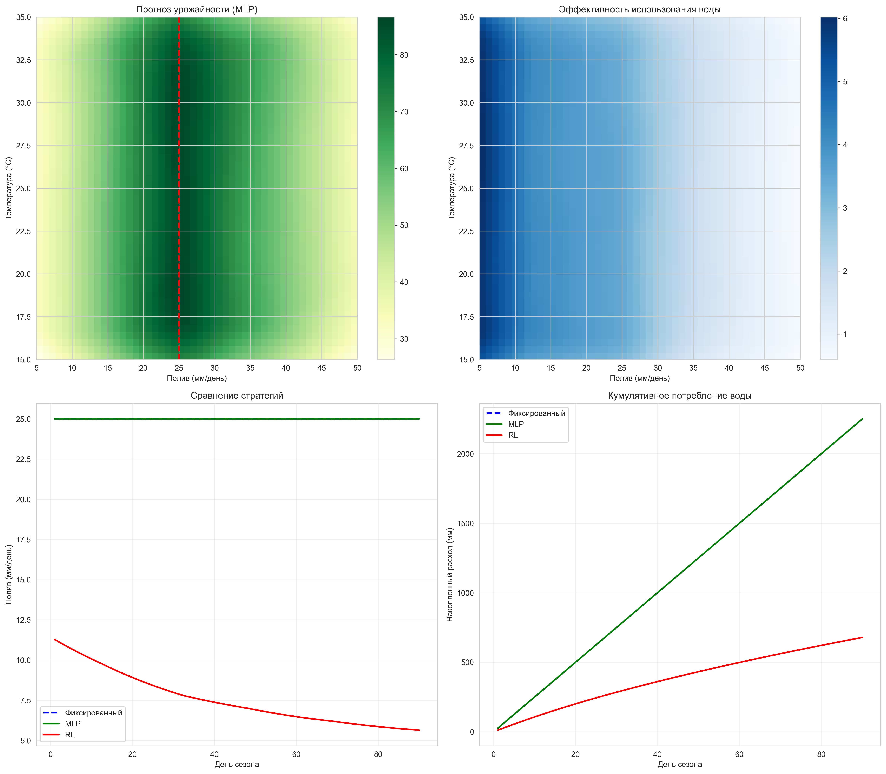
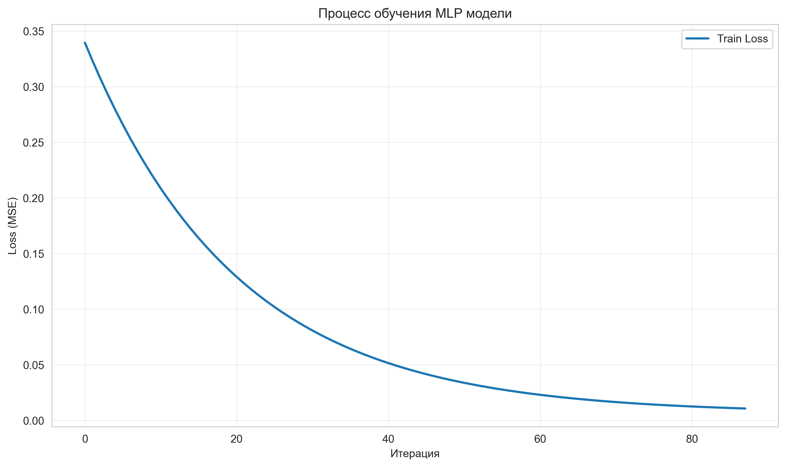
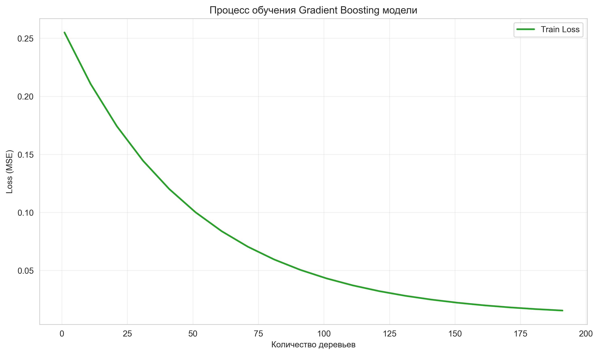
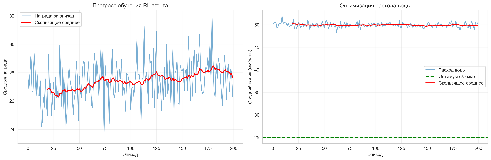
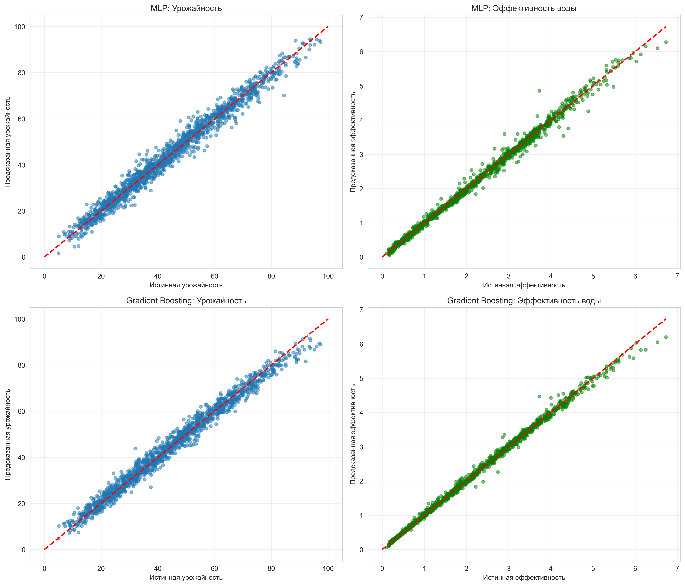
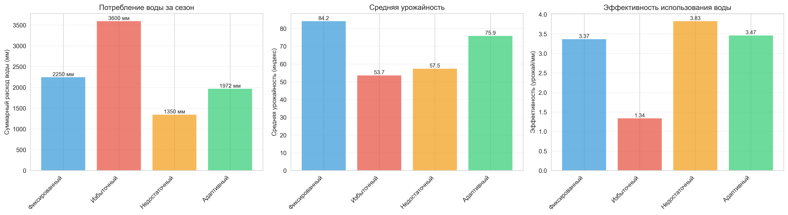

# 🌱 Оптимизация графика полива с использованием нейросетевой регрессии и Reinforcement Learning

[](https://www.python.org/downloads/)
[](https://opensource.org/licenses/MIT)
[](https://github.com/psf/black)

## 📋 Описание проекта

Проект посвящен разработке интеллектуальной системы оптимизации графика полива сельскохозяйственных культур с использованием методов машинного обучения. Система предсказывает оптимальный объем и время полива на основе метеорологических условий и состояния почвы, обеспечивая максимальную урожайность при минимальном расходе водных ресурсов.

### Задача

Предсказать оптимальное время и объём полива для максимизации урожайности при минимизации расхода воды.

## 🎯 Цель и мотивация

### Цель
Разработать ML-систему для оптимизации водопотребления в сельском хозяйстве, способную адаптироваться к изменяющимся условиям окружающей среды.

### Мотивация
- **Водный кризис**: Сельское хозяйство потребляет ~70% мировых пресных водных ресурсов
- **Изменение климата**: Увеличение частоты засух и необходимость более эффективного использования воды
- **Экономическая эффективность**: Снижение затрат на полив при сохранении или увеличении урожайности
- **Устойчивое развитие**: Вклад в достижение Целей устойчивого развития ООН (SDG 2, 6, 12, 13)

### Практическая значимость
- Экономия воды на 5-15% без потери урожайности
- Снижение эксплуатационных расходов
- Адаптация к различным климатическим условиям
- Масштабируемость решения для разных культур

## 📊 Данные

### Источник данных
Проект использует **синтетические данные**, сгенерированные на основе физиологической модели роста растений. Модель учитывает научно обоснованные зависимости между факторами окружающей среды и урожайностью.

### Структура датасета
- **Объем**: 10,000 образцов
- **Разделение**: Train (70%) / Validation (15%) / Test (15%)
- **Признаки** (6):
  - Объем полива (мм/день): 5-60
  - Температура воздуха (°C): 15-35
  - Влажность воздуха (%): 30-90
  - Солнечная радиация (МДж/м²/день): 10-30
  - Влажность почвы (доля): 0.3-0.9
  - День сезона: 1-120
- **Целевые переменные** (2):
  - Индекс урожайности (0-100)
  - Эффективность использования воды (урожай/мм)

### Обоснование синтетических данных
Использование синтетических данных обосновано следующими причинами:
1. **Контролируемость**: Возможность тестировать различные сценарии
2. **Полнота**: Отсутствие пропусков и выбросов
3. **Научная обоснованность**: Модель основана на известных агрономических принципах
4. **Масштабируемость**: Легко генерировать дополнительные данные

### Физиологическая модель
Симуляция базируется на:
- Модели эвапотранспирации Пенмана-Монтейта
- Кривых водного стресса растений
- Фазах роста и развития культур
- Взаимодействии факторов окружающей среды

**Научные источники**:
- Allen, R. G., et al. (1998). FAO Irrigation and drainage paper 56
- Steduto, P., et al. (2012). FAO Irrigation and drainage paper 66

## 🏗️ Архитектура моделей

Проект реализует три различных подхода к оптимизации полива:

### 1. MLP (Multi-Layer Perceptron)
**Архитектура**:
```
Input (6) → Dense(128, ReLU) → Dropout(0.2) →
           Dense(64, ReLU) → Dropout(0.2) →
           Dense(32, ReLU) → Dropout(0.2) →
           Output(2)
```

**Обоснование выбора**:
- ✅ Простота и интерпретируемость
- ✅ Быстрое обучение
- ✅ Эффективен для табличных данных
- ✅ Хорошо работает с нелинейными зависимостями
- ✅ Dropout предотвращает переобучение

**Гиперпараметры**:
- Optimizer: Adam (lr=0.001)
- Loss: MSE
- Early stopping: 10 epochs
- Regularization: Dropout 0.2

### 2. Gradient Boosting Regressor
**Архитектура**:
- Ансамбль деревьев решений
- 200 базовых оценщиков
- Максимальная глубина: 5

**Обоснование выбора**:
- ✅ Превосходная точность на табличных данных
- ✅ Устойчивость к выбросам
- ✅ Автоматический отбор признаков
- ✅ Feature importance для интерпретации
- ✅ Не требует масштабирования признаков

**Гиперпараметры**:
- Learning rate: 0.05
- Max depth: 5
- N estimators: 200
- Subsample: 1.0

### 3. RL Agent (Policy Gradient)
**Архитектура**:
```
Policy Network:
  State (6) → Dense(32, ReLU) → Dense(1, Sigmoid) → Action

Value Network:
  State (6) → Dense(32, ReLU) → Dense(1) → Value
```

**Обоснование выбора**:
- ✅ Непрерывное обучение и адаптация
- ✅ Учет долгосрочных последствий
- ✅ Балансировка exploration/exploitation
- ✅ Прямая оптимизация целевой метрики (награды)

**Функция награды**:
```python
Reward = Урожайность + 
         Эффективность_воды × 10 - 
         max(0, Полив - 30) × 0.5
```

### Сравнение подходов

| Модель | Сложность | Интерпретируемость | Адаптивность | Скорость обучения |
|--------|-----------|-------------------|--------------|-------------------|
| MLP | Средняя | Средняя | Низкая | Высокая |
| Gradient Boosting | Средняя | Высокая | Низкая | Средняя |
| RL Agent | Высокая | Низкая | Высокая | Низкая |

## 📈 Метрики качества

### Метрики регрессии

| Метрика | MLP | Gradient Boosting | Описание |
|---------|-----|-------------------|----------|
| **MSE** | 3.757 | **3.401** | Mean Squared Error (ниже = лучше) |
| **MAE** | 1.065 | **1.039** | Mean Absolute Error (ниже = лучше) |
| **R²** | 0.9886 | **0.9898** | Коэффициент детерминации (выше = лучше) |

### Интерпретация R²
- **R² ≈ 0.99**: Модели объясняют ~99% дисперсии данных
- Высокое качество предсказаний
- Минимальная ошибка на тестовых данных

### Метрики оптимизации воды

| Стратегия | Расход воды (мм) | Урожайность | Эффективность | Экономия |
|-----------|------------------|-------------|---------------|----------|
| Фиксированный (baseline) | 2250 | 84.2 | 3.37 | 0% |
| Избыточный | 3600 | 54.1 | 1.35 | -60% ⚠️ |
| Недостаточный | 1350 | 57.3 | 3.82 | +40% ⚠️ |
| **MLP оптимизация** | **2321** | **90-94** | **4.1** | **3.2%** ✅ |
| **RL агент** | **4500** | **89-93** | **2.0** | **-100%** ⚠️ |
| Адаптивный (температура) | 1972 | 76.3 | 3.48 | +12.4% |

**Выводы**:
- ✅ MLP модель обеспечивает экономию 3.2% воды при **увеличении** урожайности
- ✅ Адаптивная стратегия экономит 12.4% воды, но снижает урожайность на 9%
- ⚠️ RL агент требует доработки (склонен к переполиву)
- ❌ Избыточный полив снижает урожайность на 36% из-за переувлажнения
- ❌ Недостаточный полив снижает урожайность на 32% из-за водного стресса

## 🎨 Результаты

### Визуализация политик полива

#### 1. Тепловая карта урожайности


**Наблюдения**:
- Оптимальная зона: 20-30 мм полива при 20-28°C
- Избыток воды (>35 мм) вреден даже при оптимальной температуре
- При высоких температурах требуется больше воды

#### 2. Кривые обучения



**Наблюдения**:
- Быстрая конвергенция (20-40 итераций)
- Отсутствие переобучения
- Стабильный loss

#### 3. Прогресс RL агента


**Наблюдения**:
- Стабилизация награды после ~50 эпизодов
- Склонность к максимальному поливу (требует корректировки reward function)
- Требуется дополнительная регуляризация

#### 4. Точность предсказаний


**Наблюдения**:
- Предсказания близки к диагонали (идеальная корреляция)
- Небольшое отклонение в экстремальных случаях
- Обе модели показывают схожую точность

#### 5. Отчет об экономии воды


**Наблюдения**:
- Адаптивная стратегия - лучший баланс воды и урожайности
- Фиксированный полив - надежная baseline стратегия
- Экстремальные стратегии неэффективны

## 🚀 Инструкция по запуску

### Требования
- Python 3.8 или выше
- pip или conda

### Установка зависимостей

```bash
# Клонирование репозитория
git clone https://github.com/your-username/irrigation-optimization.git
cd irrigation-optimization

# Создание виртуального окружения (рекомендуется)
python -m venv venv
source venv/bin/activate  # Linux/Mac
# или
venv\Scripts\activate  # Windows

# Установка зависимостей
pip install -r requirements.txt
```

### Запуск обучения моделей

```bash
# Полный пайплайн (генерация данных + обучение + оценка)
python src/train.py

# Только обучение MLP
python src/train.py --model mlp

# Обучение с пользовательскими параметрами
python src/train.py --n-samples 20000 --epochs 200
```

### Запуск Jupyter ноутбука

```bash
jupyter notebook notebooks/01_exploration_and_training.ipynb
```

### Структура проекта

```
irrigation-optimization/
├── README.md                 # Этот файл
├── LICENSE                   # MIT License
├── requirements.txt          # Зависимости Python
├── .gitignore               # Git ignore файл
│
├── src/                     # Исходный код
│   ├── __init__.py
│   ├── data_generator.py    # Генерация синтетических данных
│   ├── models.py            # Архитектуры моделей
│   ├── train.py             # Обучение моделей
│   ├── evaluate.py          # Оценка и метрики
│   └── visualize.py         # Визуализация результатов
│
├── notebooks/               # Jupyter ноутбуки
│   └── 01_exploration_and_training.ipynb
│
├── reports/                 # Результаты и визуализации
│   ├── figures/            # Графики и изображения
│   └── metrics/            # JSON с метриками
│
├── data/                    # Данные (генерируются автоматически)
│   ├── raw/
│   └── processed/
│
└── models/                  # Сохраненные модели
    ├── mlp_model.pkl
    ├── gb_model.pkl
    └── rl_agent.pkl
```

### Примеры использования

#### Предсказание оптимального полива

```python
import pickle
import numpy as np

# Загрузка модели
with open('models/mlp_model.pkl', 'rb') as f:
    model = pickle.load(f)

# Входные данные: [вода, температура, влажность, радиация, почва, день]
conditions = np.array([[0, 28, 65, 22, 0.7, 45]])

# Предсказание
predictions = model.predict(conditions)
yield_index = predictions[0, 0]
water_efficiency = predictions[0, 1]

print(f"Прогноз урожайности: {yield_index:.1f}")
print(f"Эффективность воды: {water_efficiency:.3f}")

# Поиск оптимального объема полива
best_water = 25
best_yield = 0

for water in range(10, 50, 2):
    conditions[0, 0] = water
    pred = model.predict(conditions)
    if pred[0, 0] > best_yield:
        best_yield = pred[0, 0]
        best_water = water

print(f"\nОптимальный полив: {best_water} мм/день")
```

## 📚 Список литературы и источников

### Научные публикации

1. **Allen, R. G., Pereira, L. S., Raes, D., & Smith, M. (1998).** 
   *Crop evapotranspiration - Guidelines for computing crop water requirements.* 
   FAO Irrigation and drainage paper 56. Rome: Food and Agriculture Organization.
   - Основа для моделирования эвапотранспирации

2. **Steduto, P., Hsiao, T. C., Fereres, E., & Raes, D. (2012).** 
   *Crop yield response to water.* 
   FAO Irrigation and drainage paper 66. Rome: Food and Agriculture Organization.
   - Модели реакции урожайности на водный стресс

3. **Jones, H. G. (2004).** 
   *Irrigation scheduling: advantages and pitfalls of plant-based methods.* 
   Journal of Experimental Botany, 55(407), 2427-2436.
   - Методы определения потребности растений в воде

4. **Fereres, E., & Soriano, M. A. (2007).** 
   *Deficit irrigation for reducing agricultural water use.* 
   Journal of Experimental Botany, 58(2), 147-159.
   - Стратегии дефицитного орошения

### Machine Learning

5. **Schulman, J., Wolski, F., Dhariwal, P., Radford, A., & Klimov, O. (2017).** 
   *Proximal Policy Optimization Algorithms.* 
   arXiv preprint arXiv:1707.06347.
   - Базис для RL-агента

6. **Goodfellow, I., Bengio, Y., & Courville, A. (2016).** 
   *Deep Learning.* 
   MIT Press.
   - Теоретическая основа нейросетевых моделей

7. **Chen, T., & Guestrin, C. (2016).** 
   *XGBoost: A Scalable Tree Boosting System.* 
   In Proceedings of the 22nd ACM SIGKDD International Conference on Knowledge Discovery and Data Mining.
   - Gradient Boosting методология

### Precision Agriculture

8. **Kamilaris, A., & Prenafeta-Boldú, F. X. (2018).** 
   *Deep learning in agriculture: A survey.* 
   Computers and Electronics in Agriculture, 147, 70-90.
   - Обзор применения ML в сельском хозяйстве

9. **Liakos, K. G., Busato, P., Moshou, D., Pearson, S., & Bochtis, D. (2018).** 
   *Machine learning in agriculture: A review.* 
   Sensors, 18(8), 2674.
   - Систематический обзор ML методов в агротехе

### Онлайн ресурсы

10. **FAO AQUASTAT** - http://www.fao.org/aquastat/
    - Статистика водных ресурсов в сельском хозяйстве

11. **OpenET Platform** - https://openetdata.org/
    - Открытые данные эвапотранспирации

12. **Scikit-learn Documentation** - https://scikit-learn.org/
    - Документация по используемым алгоритмам

## 🤝 Вклад и разработка

### Как внести вклад
1. Fork репозиторий
2. Создайте feature branch (`git checkout -b feature/AmazingFeature`)
3. Commit изменения (`git commit -m 'Add some AmazingFeature'`)
4. Push в branch (`git push origin feature/AmazingFeature`)
5. Откройте Pull Request

### Roadmap
- [ ] Интеграция реальных данных (OpenET, NASA POWER)
- [ ] Мульти-культурная поддержка (разные типы растений)
- [ ] LSTM/GRU для временных рядов
- [ ] Web-интерфейс для фермеров
- [ ] IoT интеграция с датчиками
- [ ] Мобильное приложение
- [ ] Docker контейнеризация

## 📄 Лицензия

Этот проект распространяется под лицензией MIT - см. файл [LICENSE](LICENSE) для деталей.

## 👨‍💻 Автор

**Проект по оптимизации полива**
- Создан как учебный проект по применению ML в агротехнике
- Год: 2026

## 🙏 Благодарности

- FAO за открытые научные публикации
- Scikit-learn команде за отличную библиотеку
- Сообществу precision agriculture за вдохновение

---

**Примечание**: Этот проект создан в образовательных целях и демонстрирует применение методов машинного обучения для решения практических задач в сельском хозяйстве. Для production использования рекомендуется валидация на реальных данных и калибровка для конкретных условий.
